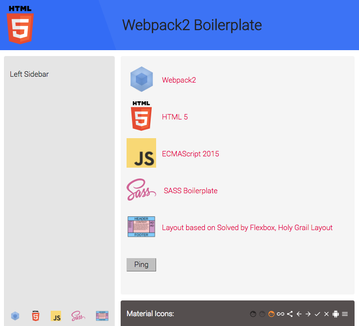

# Webpack2 boilerplate



A Webpack2 boilerplate, partly based on this Egghead.io course; [Using Webpack for Production JavaScript Applications](https://egghead.io/courses/using-webpack-for-production-javascript-applications)

>**Note:** The boilerplate has switched from [ghooks](https://github.com/gtramontina/ghooks) to [husky](https://github.com/typicode/husky). 
>To start using husky, follow these steps:
* Uninstall `ghooks` and `opt-cli`
* Delete hooks from `.git/hooks`
```
npm uninstall ghooks opt-cli
cd .git/hooks
ls | grep \.sample -v | xargs rm
cd ..
npm install husky
```

Alternatively delete your local copy of `webpack2-boilerplate` and make a new clone.
```
rm -rf webpack2-boilerplate
git clone https://github.com/leifoolsen/webpack2-boilerplate.git
```

Some husky links:
* [Prevent bad git commits and pushes with Husky](http://www.penta-code.com/prevent-bad-git-commits-and-pushes-with-husky/)
* [Prevent Bad Commits with husky](https://davidwalsh.name/prevent-bad-commits-husky)

## Features
* ES2015
* Node6 or Node7
* Npm as a task/build runner
* Webpack2 with tree-shaking and hot module replacement (HMR)
* Webpack DLL plugin for faster builds
* Express middleware
* Linting with eslint and stylelint
* Unit tests with Mocha, Chai, Sinon and JsDom 
* Code coverage with Istanbul
* SASS boilerplate with Solved by Flexbox Holy Grail example layout
* Self hosting Google Material Icons and Font Roboto
* No dependencies to frameworks like React

## Getting started
* Install Node7 or Node6 (via nvm)
* Clone this repository: `git clone https://github.com/leifoolsen/webpack2-boilerplate.git` (or download zip)
* CD to project directory: `cd webpack2-boilerplate`
* Remove existing git: `rm -rf .git`
* Install dependencies: `npm install`
* Install dll: `npm run build:dll`
* Run: `npm start`
* Open a browser at `http://localhost:8084`
* Press `Ctrl+C` to stop the devserver
* Init your git: `git init`
* Modify `package.json`, e.g. `name, author, description, repository` 
* Add your own 3'rd party dependencies  to `package.json`
* Add those 3'rd party dependencies to `./arc/vendor.js` or the `entry.vendor` section in **`webpack.config.dll`**
* Happy hacking :)

>**Note:** Remember to add your own repo to package.json 
```
  "repository": {
    "type": "git",
    "url": "https://github.com/<your-git>/<your-project>.git"
  },
```

## NPM Scripts
* `start`: run Express sever, with Hot Module Reloading (HMR), eslint and stylelint, serving files at http://localhost:8084
* `test`: run Mocha tests
* `test:watch`: run Mocha tests in watch mode
* `test:pattern`: will run Mocha tests and suites with names matching the given pattern, e.g.<br/>`pattern=Basic npm run test:pattern`
* `test:coverage`: run Istanbul code coverage (open `coverage/lcov-report/index.html` to view coverage report)
* `lint`: lint according to rules in `.eslintrc` and `.stylelintrc`
* `coverage`: runs code coverage 
* `analyze`: run webpack-bundle-size-analyzer to analyze the output bundle sizes
* `clean`: remove the dist directory
* `build`: bundle the app to the dist dir using development settings
* `build:prod`: bundle the app to the dist dir using production settings
* `start:build`: run Express sever with the generated bundle, serving files at http://localhost:8000

## Test the bundle
* `npm run build:prod`
* `npm run start:build`
* Open a browser at `http://localhost:8000`

### Test the API
* Click the "Ping" button or open a browser at `http://localhost:8000/api/ping`. The response should be: `{"ping":"pong!"}`
